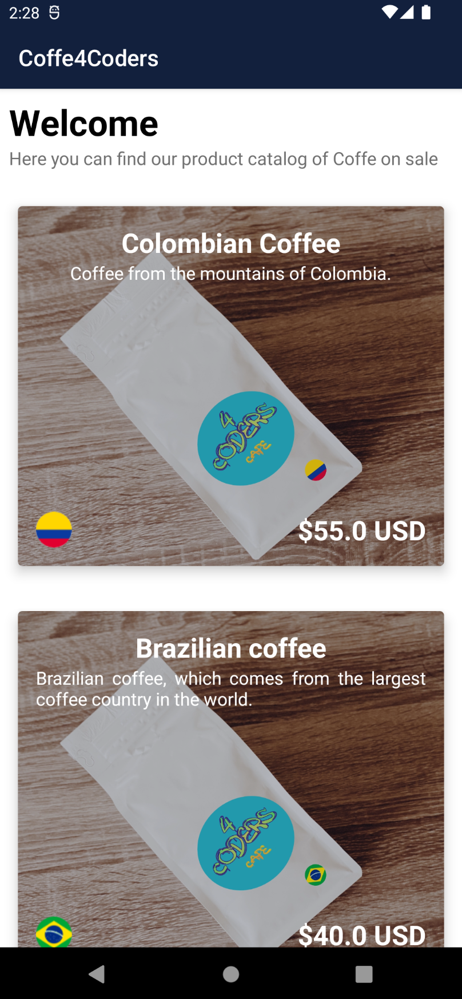
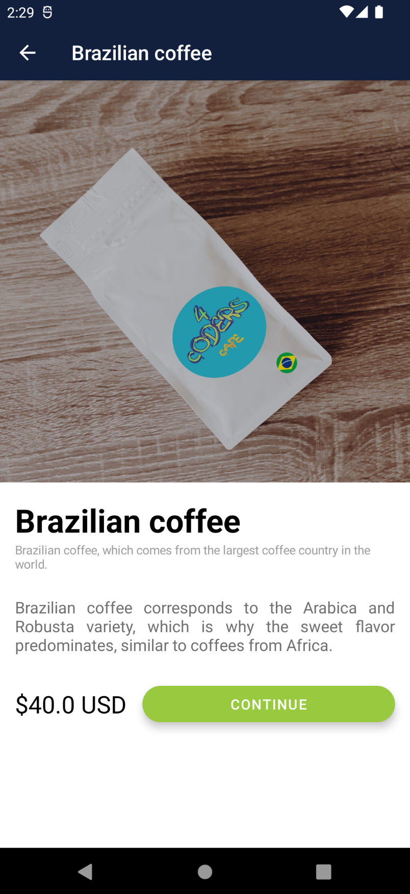
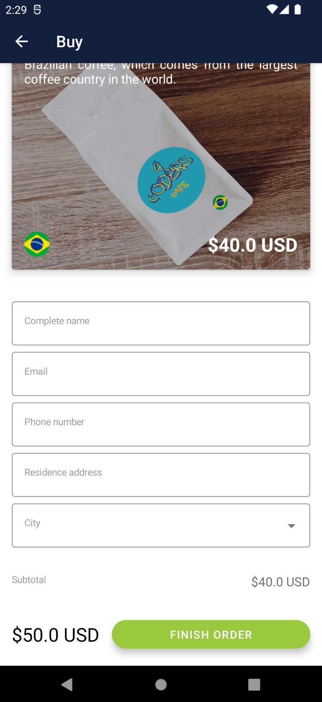
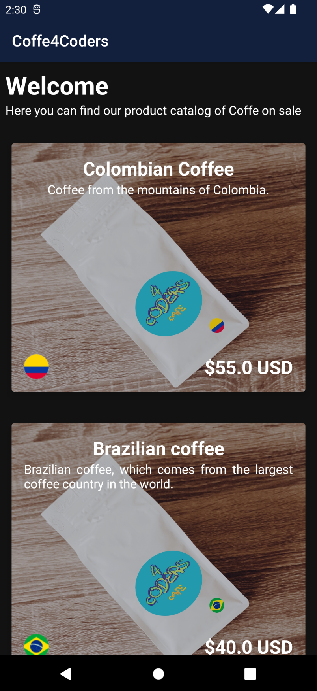
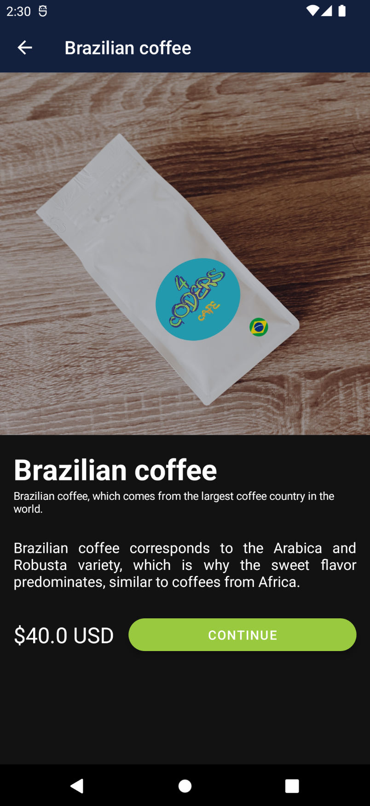
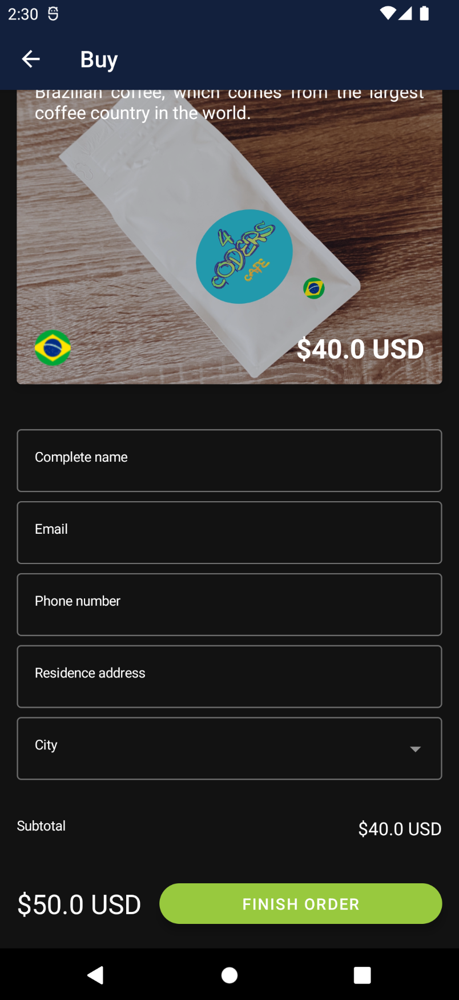

# Coffe4Coders

A sample app of Jetpack Compose. Shows a little list of Coffee products with descriptions, price and buy buttons. This app is based on Platzi's Coffe4Coders from *Android Jetpack Compose Course*.

## Light mode samples

  
  
  

## Dark mode samples

  
  
  

## License
MIT

## About the author
*[Jhonyfer's blog](https://viejony.github.io/blog/en)*